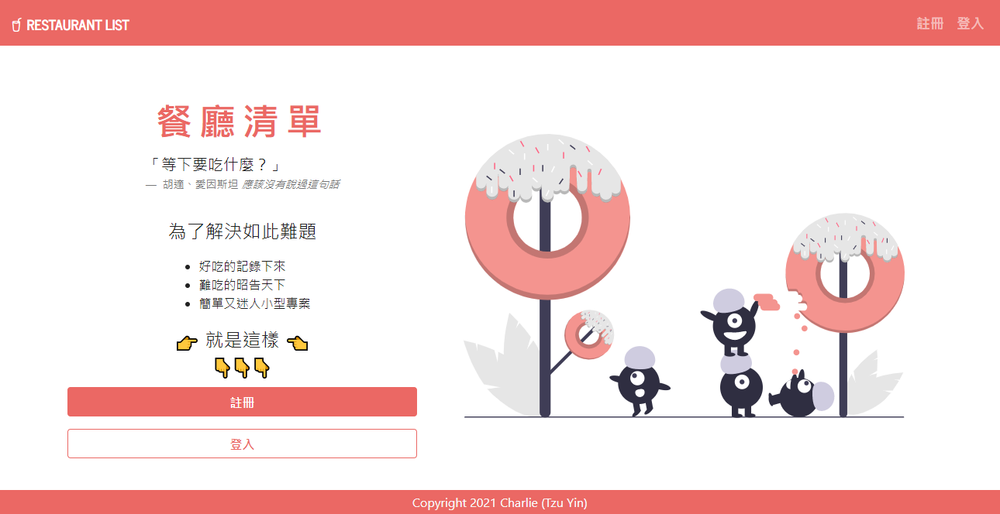
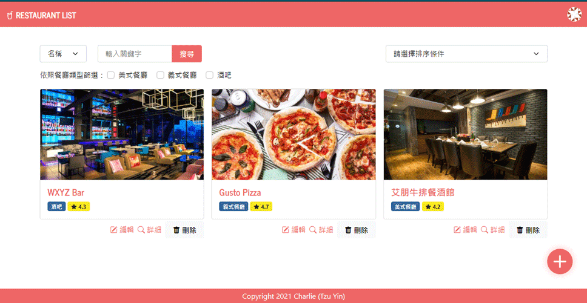
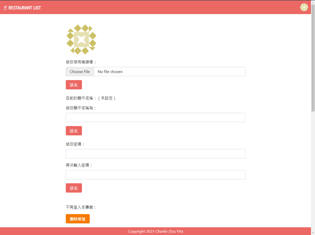

# Alpha Camp 2-3 作業：打造餐廳清單

## 功能介紹
- 使用者可使用Facebook、Google或LINE帳號登入本專案
- 點擊每一張餐廳的卡片，即可瀏覽該餐廳的詳細資訊
- 點擊首頁右下角+號，可新增餐廳
  
  - 支援使用者上傳餐廳照片
  - 沒有上傳照片的情況下，系統會自動提供預設餐廳照片
- 可執行簡易搜尋
  - 目前支援搜尋餐廳名稱、類型、地址與描述內容
- 可根據餐廳評分與類型進行排序
- 支援使用者上傳頭像圖片、修改顯示名稱
  
  - 除展示用帳號、與透過第三方帳號登入本專案的使用者以外，支援修改登入密碼
  - 除展示用帳號以外，支援刪除帳號

## 環境需求
- [git](https://git-scm.com/downloads)
- [Node.js](https://nodejs.org/en/)
- [npm](https://www.npmjs.com/get-npm)

## 開啟流程
1. `git clone https://github.com/tzynwang/ac_assignment_2-3_w1_restaurants-re.git`
1. `cd ac_assignment_2-3_w1_restaurants-re`
1. `code .`開啟本專案，參考[此份文件](https://docs.google.com/document/d/1lovClJzfHw5cARsQ_pbVXoYsHkCm3G1hc8Um-zqmYsw/edit?usp=sharing)，將根目錄`.env.example`檔案中列為SKIP的部分替換為相關ID與金鑰內容
1. 將`.env.example`檔案名稱修改為`.env`
1. `npm install`
1. `npm run seed`
1. `npm run start`
1. 待終端機出現「`Express is listening on localhost:3000/welcome`」字樣後，即可使用瀏覽器開啟本專案：[http://localhost:3000/welcome](http://localhost:3000/welcome)
1. 展示用帳號：
    - Email： `demo@demo.com`
    - 密碼：`12345678`
    - 備註：展示用帳號無法體驗「修改密碼」與「刪除帳號」之功能

## 銘謝
- [unDraw](https://undraw.co/)：專案首頁主視覺圖片
- [Hiring Artists Website Design](https://dribbble.com/shots/6158271-Hiring-Artists-Website-Design)：專案首頁版面設計參考
- [BOOTSWATCH: Journal](https://bootswatch.com/journal/)：專案CSS模板
- [Material: Color palettes](https://material.io/design/color/the-color-system.html#tools-for-picking-colors)：專案配色計算機
- [DiceBear Avatars](https://avatars.dicebear.com/docs/http-api)：使用者頭像API

## 開發者
Charlie (Tzu Yin)
- Email: tzyn.wang🍩gmail.com（🍩→@）
- Blog: [普通文組](https://tzynwang.github.io/)